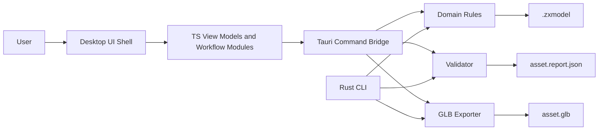
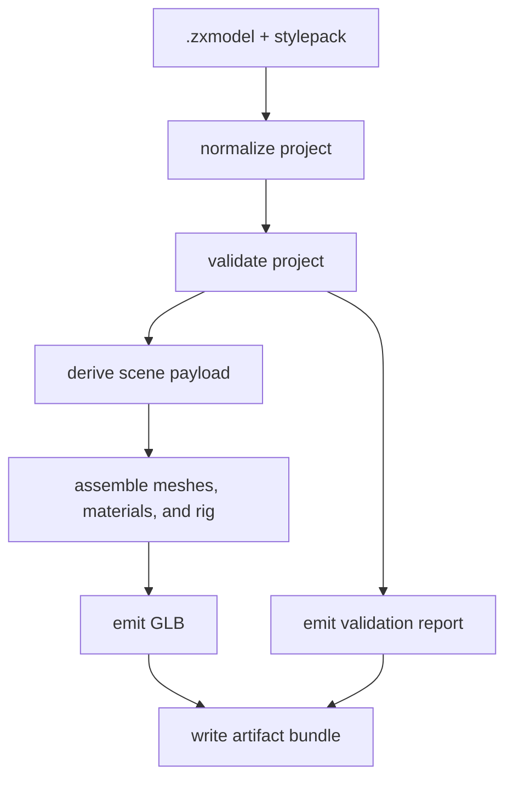

# MASTER_SPEC
This file is a consolidated source-of-truth bundle for PolyBash.
Use it when an agent or collaborator needs one document instead of the full pack.


---
## Included from `AGENTS.md`

# AGENTS.md

## Project identity

**Project codename:** PolyBash

PolyBash is a beginner-friendly retro 3D asset builder for game-ready meshes. It targets a workflow between Asset Forge and Blender: guided kitbashing, constrained shaping, palette/material assignment, basic painting, rig templates, clean GLB export, and a strict validator for Nethercore ZX-style constraints.

This repository exists to deliver an **end-to-end vertical slice first**, then expand to the broader v1 feature set described in the docs.

## Source of truth

When working in this repository, use these files in this order:

1. `MASTER_SPEC.md`
2. `docs/01-PRD.md`
3. `docs/02-TECHNICAL-ARCHITECTURE.md`
4. `docs/04-TDD-QUALITY-GATES.md`
5. `docs/05-ACCEPTANCE-TEST-MATRIX.md`
6. `codex/taskboard.yaml`

If there is a conflict:
- `MASTER_SPEC.md` wins over everything else.
- The PRD wins over implementation convenience.
- The acceptance matrix wins over undocumented assumptions.

## Hard engineering rules

1. **TDD is mandatory.**
   - Every feature starts with a failing test, failing fixture, or failing contract check.
   - Follow **Red 竊・Green 竊・Refactor** on every work item.
   - Do not write implementation-first code unless the work item is strictly mechanical and already covered by tests.

2. **Keep trunk green.**
   - No broken builds on the main branch.
   - No skipped tests unless explicitly allowed in the docs.
   - No TODO/FIXME comments without a linked task ID in `codex/taskboard.yaml`.

3. **Prefer the smallest vertical slice.**
   - If a full feature is too large, land the thinnest end-to-end slice that still satisfies the acceptance criteria.
   - Do not expand scope to 窶從ice to have窶・work until the current acceptance criteria are green.

4. **Validation is a product feature.**
   - Do not bypass validators to make tests pass.
   - Validation errors must be explicit, typed, and tested.
   - Silent fallback behavior is prohibited unless documented and covered by tests.

5. **Determinism matters.**
   - Serialization, export, and validation outputs should be deterministic.
   - Snapshot and golden tests must be stable.
   - Avoid time-dependent or nondeterministic behavior in exported artifacts unless intentionally injected behind a seam.

6. **Preserve architectural boundaries.**
   - TypeScript desktop shell code handles UI, native integration adapters, and orchestration.
   - Rust core handles contracts, domain rules, validation, export logic, and deterministic transforms.
   - Shared contracts and desktop bridge payloads must be versioned and test-covered.

7. **No hidden AI magic.**
   - LLM assistance must emit structured edit commands or structured suggestions.
   - No direct opaque text-to-mesh behavior.
   - Every generated edit must be previewable, reversible, and validated.

## Scope discipline

### Mandatory overnight target
The 窶徙vernight窶・target is **not** the whole long-term product. It is the first complete walking skeleton:

- monorepo scaffold
- Rust workspace with contracts, validation, export core, and CLI
- standalone desktop shell in TypeScript with a Tauri bridge
- `.zxmodel` authoring format
- style pack loading
- module placement and snap/connect logic
- constrained deformation on authored regions
- material zone assignment
- rig template assignment (rig metadata only is acceptable in the first slice)
- GLB export
- validator report
- fixture-driven tests and CI

### Explicitly out of overnight scope unless all mandatory items are green
- rich freehand paint tools
- full animation timeline
- smooth skin painting UI
- marketplace/distribution
- multiplayer collaboration
- shader graph
- booleans/CSG modeling
- procedural node graphs
- direct online LLM integration

## Decision defaults

If a choice is unspecified, use these defaults:

- coordinate system: right-handed, Y-up
- units: meters
- authoring source format: `.zxmodel` JSON
- export format: `.glb`
- texture format: PNG
- desktop UI language: TypeScript
- desktop shell build: `pnpm` + `vite`
- desktop bridge: Tauri
- core language: Rust stable
- schema generation: Rust source of truth with generated JSON Schema
- TS runtime contract validation: AJV against generated schemas
- Rust testing: `cargo test`, `proptest`, integration fixtures
- TS testing: `vitest`
- CI: GitHub Actions
- versioning: SemVer for schema and package versions

## How to behave during implementation

For each task:

1. Read the relevant spec section.
2. Write or update the failing test(s) first.
3. Implement the smallest passing change.
4. Refactor for clarity and boundary hygiene.
5. Run the narrow test set.
6. Run the relevant full suite.
7. Update docs, fixtures, and task status.
8. Record remaining risks honestly.

When blocked:
- reduce scope
- preserve the architecture
- keep the repository buildable
- leave a clear gap report rather than half-finished code

## Required output in task summaries

Every task summary should include:

1. what was implemented
2. what tests were added first
3. what validation commands were run
4. what remains incomplete
5. what assumptions were made

## Approval rules for LLM-related features

Any natural-language-driven operation must:
- compile into explicit structured commands
- run through the same validators as manual edits
- support preview before apply
- support undo after apply
- log its operations for debugging

## Repository navigation hints

- `docs/` contains product and engineering specs
- `codex/` contains orchestration material and prompts
- `examples/` contains canonical fixtures for development and tests

Do not invent alternate contracts when the examples or docs already define one.


## OpenAI and Codex documentation lookup

Always use the OpenAI developer documentation MCP server if you need to work with the OpenAI API, ChatGPT Apps SDK, Codex, or related docs without me having to explicitly ask.

---

## Included from `00-START-HERE.md`

# PolyBash 窶・Start Here

This pack is designed to make an agentic build practical, not magical.

The package contains:
- a product requirements document
- a technical architecture
- a work breakdown structure
- TDD and validation rules
- an acceptance test matrix
- a risk register
- a repository blueprint
- a Codex runbook and prompt pack
- canonical example fixtures

## What this pack is optimized for

It is optimized for an **overnight end-to-end vertical slice**, not the entire long-term product in one pass.

The overnight target is:

1. initialize the monorepo
2. implement the contracts and schemas
3. implement the Rust validation/export core
4. implement the TypeScript standalone desktop shell and Tauri bridge
5. support loading/saving `.zxmodel` through the desktop document flow
6. support module placement and snap/connect logic
7. support constrained deformation on authored regions
8. support material zone assignment
9. support rig template metadata assignment
10. export `.glb`
11. produce a validator report
12. leave the repo green with CI and tests

If all of that lands cleanly, the next pass can extend painting, rigging fidelity, and LLM integration.

## How to use this with Codex

### Option A 窶・give Codex one file
Use `MASTER_SPEC.md` plus `AGENTS.md`.

### Option B 窶・give Codex the full pack
Give Codex the entire folder. This is better.

### Recommended execution order

1. Read:
   - `AGENTS.md`
   - `MASTER_SPEC.md`
   - `codex/STANDALONE_PIVOT.md`
   - `codex/00-OVERNIGHT-RUNBOOK.md`

2. Start the launch/bootstrap task:
   - `codex/prompts/00-LAUNCH-STANDALONE.md`

3. Build the headless and bridge foundations:
   - `codex/prompts/01-BOOTSTRAP-AND-CONTRACTS.md`
   - `codex/prompts/02-FIXTURES-AND-DOMAIN.md`
   - `codex/prompts/03-VALIDATOR-AND-EXPORT.md`
   - `codex/prompts/04-CLI.md`

4. Then harden the desktop shell workflows:
   - `codex/prompts/05-PLUGIN-SHELL.md` (legacy filename; desktop shell scope)
   - `codex/prompts/06-PLUGIN-WORKFLOWS.md` (legacy filename; desktop workflow scope)

5. Finish with:
   - `codex/prompts/07-ACCEPTANCE-AND-CI.md`
   - `codex/prompts/08-GAP-REPORT-AND-HANDOFF.md`

## What 窶彡omplete窶・means here

A 窶彡omplete overnight run窶・means:
- the walking skeleton is implemented end to end
- tests are present and green
- acceptance coverage exists for every P0 requirement
- the repo builds in a clean environment
- known gaps are clearly documented
- no critical path is hand-waved

It does **not** mean:
- every long-term feature in the PRD is production-polished
- every UI interaction is fully desktop-integrated and manually smoke tested
- every future asset category is fully supported

## Recommended human review the next morning

1. Open the gap report.
2. Verify the examples load and export.
3. Review CI logs.
4. Review the validator output format.
5. Confirm that any remaining gaps are in non-critical areas.
6. Only then decide whether to keep iterating or branch into polish.

## Contents

- `docs/01-PRD.md`
- `docs/02-TECHNICAL-ARCHITECTURE.md`
- `docs/03-WBS-AND-MILESTONES.md`
- `docs/04-TDD-QUALITY-GATES.md`
- `docs/05-ACCEPTANCE-TEST-MATRIX.md`
- `docs/06-RISK-REGISTER.md`
- `docs/07-REPO-BLUEPRINT.md`
- `codex/00-OVERNIGHT-RUNBOOK.md`
- `codex/taskboard.yaml`
- `codex/prompts/*.md`
- `examples/*.json`

---

## Included from `docs/01-PRD.md`

# Product Requirements Document (PRD)

## 1. Product overview

**Working name:** PolyBash

PolyBash is a beginner-friendly retro 3D asset builder focused on creating game-ready meshes that sit between Asset Forge and Blender.

It is intended to support:
- props
- weapons
- characters
- vehicles
- modular environment chunks

The product ships as a **standalone desktop application** with:
- module-driven kitbashing
- constrained shaping instead of full freeform modeling
- palette and material assignment
- lightweight paint-layer support
- rig templates and rig metadata
- strict export validation
- clean GLB export
- an optional LLM-assisted structured editing layer

The output target is a pipeline suitable for Nethercore ZX-style games and similar retro 3D engines.

## 2. Problem statement

General-purpose DCCs are powerful but hostile to beginners and slow for constrained retro asset production. Simple kitbash tools are fast, but too limiting for expressive characters, weapons, vehicles, and reusable game assets.

The gap:
- beginners need structure
- technical users need speed
- game developers need export-ready assets
- retro aesthetics benefit from explicit constraints and validation

## 3. Product vision

Create a constrained 3D asset builder that:
- feels approachable to non-expert modelers
- still produces usable, game-ready meshes
- preserves style consistency through style packs
- avoids "mini-Blender" scope creep
- can hand off to Blender for advanced animation when needed

## 4. Target users

### Primary
Solo and small-team indie game developers making retro 3D games.

### Secondary
Technical artists or designers who want to author variations quickly without deep modeling knowledge.

### Tertiary
Writers and designers using LLM assistance to propose characters or props that can then be turned into structured editable assets.

## 5. Primary use cases

1. Create a fighter character from a template in the desktop app, swap parts, adjust silhouette, assign palette and material zones, export to GLB, and continue animation in Blender.
2. Create a weapon or prop by assembling modules and adjusting a few guided deformation controls.
3. Create modular environment chunks using connectors and a style pack with enforced texture and mesh budgets.
4. Use natural language to request structured edits, preview them, and apply them safely.

## 6. Goals

### Product goals
- Enable a novice to produce a usable retro asset quickly.
- Keep assets within style-pack and engine budget constraints.
- Export deterministic game-ready GLB files.
- Preserve an editable authoring format.
- Support a direct path to Blender for animation and polish.
- Make validation a first-class feature rather than an afterthought.

### Engineering goals
- Maintain a strict separation between desktop UI logic and deterministic core logic.
- Drive development with TDD.
- Make contracts explicit and versioned.
- Make all critical paths testable in headless CI.

## 7. Non-goals

PolyBash v1 is **not**:
- a full DCC replacement
- a sculpting tool
- a node material editor
- a full animation package
- a cloth or hair simulation tool
- a procedural modeling graph tool
- a marketplace platform
- an unconstrained text-to-mesh generator

## 8. UX principles

1. **Guided over open-ended**
   Prefer templates, constrained edits, and high-signal controls.

2. **Game-ready by default**
   Export, budgets, and validation are always visible.

3. **Beginner-friendly, not toy-like**
   The system should feel approachable without preventing professional output.

4. **Visual edits should map to clear data**
   Every user action should correspond to structured project data.

5. **Safe LLM assistance**
   Natural-language input should produce reversible structured edits.

## 9. Product scope

## 9.1 Overnight target (P0 walking skeleton)

The overnight target is the smallest end-to-end product slice that proves the standalone architecture:

- create, open, and save `.zxmodel`
- support native desktop document dialogs
- load a style pack
- load module descriptors
- browse modules by category
- add and remove modules in a scene
- attach and detach connectors using snap and compatibility rules
- apply constrained deformations to authored regions
- assign material zones from a palette or material preset
- assign a rig template and socket metadata
- export `.glb` through the Rust-owned export path
- run validation and emit a report through the Rust-owned validation path
- provide example fixtures and tests

## 9.2 V1 scope

### Asset authoring
- templates for fighter, prop, weapon, vehicle, and room chunk
- part library with category filters and tags
- symmetry and mirroring support
- connector-driven placement
- transform gizmo integration
- constrained silhouette controls

### Surface workflow
- material slot assignment
- palette presets
- texture atlas generation and management
- decals and basic paint layers
- texture import and export

### Rigging and export
- biped, mech, and vehicle rig templates
- rigid, hybrid, and smooth rig modes
- sockets and engine metadata
- GLB export
- validation report

### LLM assistance
- convert natural language into structured edit suggestions
- preview before apply
- apply with undo support
- validator-aware feedback

## 9.3 Deferred after v1

- advanced paint brushes
- smooth skin paint UI
- animation timeline and editor
- custom shader authoring
- online sharing and distribution
- collaborative editing

## 10. Functional requirements

### FR-01 Project lifecycle
The system must create, open, save, and version `.zxmodel` files through the standalone desktop document workflow and the headless CLI.

### FR-02 Template initialization
The system must initialize a new project from a supported template:
- fighter
- prop
- weapon
- vehicle
- modular chunk

### FR-03 Style packs
The system must load a style pack that defines:
- budgets
- palette and material presets
- connector taxonomy
- rig templates
- paint rules
- asset category allowances

### FR-04 Module library
The system must display modules by:
- category
- asset type
- tags
- compatibility with the current style pack

### FR-05 Placement
The system must place module instances in the scene with transform metadata and stable instance ids.

### FR-06 Snap and connect
The system must support connector-based attachment and detachment with validation of compatible connector types.

### FR-07 Symmetry and mirroring
The system must support mirrored placement or mirrored module generation where applicable.

### FR-08 Guided deformation
The system must support constrained deformations on authored regions, including a minimal initial set:
- scale
- taper
- bulge
- bend
- twist

### FR-09 Material zones
The system must allow per-zone material and palette assignments.

### FR-10 Paint layers
The system must support a minimal paint layer model:
- fill
- decal
- optional brush stroke placeholder in the first slice

### FR-11 Rig templates
The system must apply rig templates and store rig metadata on the asset.

### FR-12 Socket metadata
The system must support named sockets or hardpoints bound to bones or transforms.

### FR-13 Export
The system must export a GLB file suitable for downstream tools and engine ingestion from both the desktop shell and the CLI.

### FR-14 Validation
The system must validate:
- mesh budgets
- texture budgets
- style pack constraints
- connector integrity
- required metadata
- export completeness

### FR-15 Reporting
The system must emit a structured report summarizing statistics, warnings, and errors.

### FR-16 Undoability
Edits must be representable as reversible project operations, at least at the command level.

### FR-17 LLM command layer
The system must define a structured command DSL for natural-language-assisted edits, even if the first overnight slice ships with a mock or stub interpreter.

## 11. Non-functional requirements

### NFR-01 Determinism
The same input project and style pack must produce the same export and report.

### NFR-02 Headless testability
Critical logic must be runnable in CI without the desktop GUI host.

### NFR-03 Performance
Common operations on a typical fighter asset should feel interactive on a normal development machine.

### NFR-04 Safety
Validation and import or export paths must fail explicitly on invalid inputs.

### NFR-05 Compatibility
The system must keep authoring and export contracts versioned and backwards-conscious.

### NFR-06 Observability
Failures must produce actionable errors.

### NFR-07 Coverage
Critical core logic must meet the coverage and test gate requirements defined in the quality doc.

## 12. Success metrics

### Product metrics
- A new user can produce a basic fighter asset in under 20 minutes using a template and modules.
- The export path works on all canonical fixtures.
- Validation catches out-of-budget fixtures before export acceptance.
- The authoring format stays editable after repeated load and save cycles.

### Engineering metrics
- All P0 acceptance criteria are automated except explicitly documented manual smoke checks.
- Core contract, validation, and export crates meet coverage targets.
- The standalone desktop shell and core workspace build reproducibly from a clean environment.

## 13. Constraints and assumptions

- The first implementation is a focused standalone desktop authoring tool, not a full general-purpose DCC.
- The desktop shell owns the editor chrome, document workflow, and viewport integration for v1.
- Rust is the deterministic core.
- TypeScript powers the desktop UI shell.
- Tauri is the desktop bridge layer.
- Blender remains the downstream animation tool.
- GLB is the export target.
- `.zxmodel` is the authoring source of truth.

## 14. Open issues intentionally closed by decision

The following are treated as resolved defaults for v1 so implementation can begin without drift:

- animation authoring is downstream, not in scope for overnight
- style packs own budgets and palettes
- LLM assistance uses structured commands only
- direct freeform mesh editing is not the main workflow
- validation runs both during authoring and export

---

## Included from `docs/02-TECHNICAL-ARCHITECTURE.md`

# Technical Architecture

## 1. Architecture summary

PolyBash is a **standalone desktop editor + deterministic core** system.

- **Editor shell:** standalone desktop application
- **Desktop UI layer:** TypeScript + web UI
- **Desktop bridge:** Tauri commands into Rust services
- **Core domain + contracts + export + validation:** Rust
- **Primary authoring format:** `.zxmodel`
- **Export target:** `.glb`
- **Core distribution targets:** native CLI + desktop bridge + optional WebAssembly bridge
- **Headless validation target:** CI-friendly command line

The architecture deliberately avoids turning the desktop shell into the source of truth. The desktop UI is the interaction layer. The Rust core owns contracts, normalization, validation, command semantics, and export behavior.

## 2. Design principles

1. **Own the source format**
   - `.zxmodel` is the canonical authoring format.
   - GLB is output, not the editable source of truth.

2. **Deterministic core**
   - export, validation, and contract logic live in Rust
   - the same behavior should be available to CLI and desktop shell via the shared core

3. **Headless first**
   - anything critical must be testable without the desktop GUI running

4. **Constrained editing**
   - the domain model is module-based and region-based, not arbitrary topology-based

5. **Versioned contracts**
   - schemas and reports are versioned and backward-conscious

## 3. High-level component model



## 4. System responsibilities

### 4.1 Desktop shell responsibilities

- document creation, open, and save flows
- panels, inspectors, module browsing, and workflow commands
- viewport interaction, selection, and gizmo orchestration
- edit orchestration and UI state
- calling Rust services through the desktop bridge
- surfacing validation results, export feedback, and actionable errors

### 4.2 Rust core responsibilities

- contract types and schema generation
- domain normalization
- connector compatibility checks
- deformation math
- budget calculations
- style pack rules
- export assembly
- validation report generation
- structured command DSL validation for LLM edits

### 4.3 CLI responsibilities

- batch validate
- batch export
- headless fixture tests
- CI integration
- developer diagnostics

### 4.4 Desktop bridge responsibilities

- narrow, versioned command surface between UI and Rust
- input and output serialization at the process boundary
- typed error translation into desktop-safe responses
- reuse of the same core services exercised by the CLI

## 5. Current implemented desktop workflows

The current standalone walking skeleton already includes:

- native open and save dialogs
- canonical load and explicit path-based load
- fighter template creation from a style pack
- module add and remove
- transform edits through typed commands
- connector attach and detach
- region parameter edits through typed commands
- material zone edits through typed commands
- rig template selection
- socket metadata authoring
- Rust-owned validation and export preview

These flows live in the desktop app shell, but the underlying state transitions, validation, and export semantics remain Rust-owned.

## 6. Repository structure

```text
polybash/
|- AGENTS.md
|- MASTER_SPEC.md
|- docs/
|- codex/
|- examples/
|- contracts/
|  `- generated/
|- crates/
|  |- polybash-contracts/
|  |- polybash-domain/
|  |- polybash-ops/
|  |- polybash-validate/
|  |- polybash-export/
|  |- polybash-llm/
|  |- polybash-cli/
|  `- polybash-wasm/
|- desktop/
|  |- src/
|  |  |- main.ts
|  |  |- documentPaths.ts
|  |  |- documentInspector.ts
|  |  |- sceneProjection.ts
|  |  |- viewportController.ts
|  |  |- types.ts
|  |  `- colocated desktop UI tests
|  `- src-tauri/
|     |- src/
|     |  |- main.rs
|     |  `- lib.rs
|     `- capabilities/
|- plugin/                 # legacy scaffold, not the active product path
|- fixtures/
|  |- projects/
|  |- stylepacks/
|  |- reports/
|  `- exports/
`- .github/workflows/
```

## 7. Data model overview

## 7.1 Core entities

### Project

The top-level editable document.

Fields:
- project metadata
- asset metadata
- style pack reference
- module instances
- paint layers
- rig block
- socket metadata
- export preset
- history metadata

### StylePack

Defines the rules for a coherent asset family.

Fields:
- id and version
- supported asset types
- triangle, material, and texture budgets
- palettes and material presets
- allowed module categories
- connector taxonomy
- deformation limits
- rig template definitions
- paint rules

### ModuleDescriptor

Defines a reusable asset module.

Fields:
- id and version
- asset type
- tags and category
- connector list
- region list
- material zones
- optional rig tags
- mesh reference
- default transform
- symmetry metadata

### ModuleInstance

Placement of a module descriptor inside a project.

Fields:
- instance id
- module id
- transform
- connector attachment info
- region overrides
- material zone assignments
- optional mirror metadata

### RigTemplate

Defines a rig preset.

Fields:
- id
- asset type compatibility
- bones
- bind pose metadata
- weighting mode
- socket defaults
- export hints

### ValidationReport

Structured output for authoring and export checks.

Fields:
- summary stats
- warnings
- errors
- budget usage
- missing metadata
- source versions
- export status

## 7.2 Canonical formats

### `.zxmodel`
Editable project document.

### `stylepack.json`
Versioned style pack.

### `module.json`
Versioned module descriptor.

### `asset.report.json`
Validation and export report.

### `.glb`
Interchange artifact for downstream tools and engine ingestion.

## 8. Rust workspace

### 8.1 `polybash-contracts`

Responsibilities:
- canonical Rust structs
- serde support
- schema generation
- version identifiers
- shared enums and ids

### 8.2 `polybash-domain`

Responsibilities:
- project normalization
- command application
- invariant checks
- basic state transitions
- load and save services

### 8.3 `polybash-ops`

Responsibilities:
- connector math
- transform helpers
- region deformation math
- bounding box and metric calculations

### 8.4 `polybash-validate`

Responsibilities:
- style pack validation
- budget validation
- metadata validation
- connector integrity validation
- export readiness validation

### 8.5 `polybash-export`

Responsibilities:
- transform normalized project into scene payload
- build GLB
- emit report statistics
- attach export metadata

### 8.6 `polybash-llm`

Responsibilities:
- define structured edit command DSL
- validate command payloads
- translate domain-safe command sequences into project mutations

Note: the first implementation can omit live model calls and focus on the command contract.

### 8.7 `polybash-wasm`

Responsibilities:
- expose selected Rust core functions to TypeScript when a browser-facing or embedded web target is needed
- maintain parity tests for validate and export behavior

This is a secondary surface, not the primary desktop integration path.

### 8.8 `polybash-cli`

Responsibilities:
- headless export and validation
- fixture runners
- developer commands

## 9. Desktop TypeScript surface

The current desktop package is intentionally thin and uses flat modules rather than a large framework:

- `main.ts`
  - app shell
  - Tauri command invocation
  - document actions
  - inspector event wiring
- `documentPaths.ts`
  - native dialog path normalization
  - save-path suggestion helpers
- `documentInspector.ts`
  - module cards
  - module library projection
  - connector options
  - rig detail projection
- `sceneProjection.ts`
  - deterministic low-poly proxy scene projection
- `viewportController.ts`
  - Three.js viewport mounting and selection callbacks
- `types.ts`
  - desktop-facing TypeScript types
- colocated `*.spec.ts`
  - headless desktop UI workflow coverage

## 10. Boundary contract: desktop UI <-> core

The desktop UI must not reach into Rust internals conceptually. Cross-boundary communication should be narrow and versioned.

Current implemented commands include:
- `load_canonical_document_command`
- `create_fighter_template_command`
- `load_document_command`
- `save_project_command`
- `add_module_instance_command`
- `remove_module_instance_command`
- `apply_edit_command_command`
- `set_connector_attachment_command`
- `clear_connector_attachment_command`
- `validate_document_command`
- `export_document_command`

Conceptually, these map to:
- load project
- save project
- validate project
- apply edit commands
- set or clear connector relationships
- export GLB bundle

The current typed edit-command path covers:
- transform updates
- region parameter updates
- material assignment
- rig template assignment
- socket authoring

## 11. Editing model

## 11.1 Module-driven scene graph

Projects are built from module instances attached via connectors or free placement.

## 11.2 Region-driven deformation

Deformations are defined only on authored regions:
- torso.chest
- jaw.width
- shoulder.width
- blade.length
- fender.curve

This avoids arbitrary mesh editing as a first-class concern.

## 11.3 Material zones

Every module exposes explicit material zones:
- primary
- trim
- accent
- skin
- visor
- tire

Material assignment happens at zone level before advanced painting.

## 11.4 Paint layers

Paint sits on top of material zones:
- fill
- decal
- optional brush layer
- future weathering layer

## 12. LLM command DSL

LLM assistance must target a safe DSL.

Example operations:
- `add_module`
- `remove_module`
- `replace_module`
- `set_transform`
- `set_region_param`
- `set_material_zone`
- `set_palette`
- `attach_socket`
- `assign_rig_template`

Example payload:

```json
[
  {
    "op": "replace_module",
    "targetInstanceId": "hair_01",
    "withModuleId": "hair_short_spiky_a"
  },
  {
    "op": "set_region_param",
    "targetInstanceId": "head_01",
    "region": "jaw",
    "param": "width",
    "value": 1.12
  }
]
```

Rules:
- commands are validated before apply
- invalid commands produce structured errors
- preview mode computes diff without mutation
- apply mode returns an undo payload

## 13. Export pipeline



Export bundle:
- `asset.glb`
- `asset.report.json`
- optional debug JSON in dev builds

## 14. Validation pipeline

Validation stages:
1. schema validity
2. project invariants
3. connector integrity
4. style pack compatibility
5. budget checks
6. metadata completeness
7. export readiness

All validation messages should be typed:
- `error`
- `warning`
- `info`

Suggested message fields:
- code
- severity
- path
- summary
- detail
- suggested_fix

## 15. Canonical budgets for first style pack

These are recommended defaults, not engine law.

### Fighter
- triangles: 2,500
- materials: 3
- textures: 1 atlas
- atlas max: 512x512
- bones: 32
- sockets: 8

### Weapon
- triangles: 900
- materials: 2
- atlas max: 256x256

### Prop small
- triangles: 600
- materials: 2
- atlas max: 256x256

### Vehicle small
- triangles: 4,500
- materials: 4
- atlases: 2 x 512x512

## 16. Error handling strategy

- never silently drop invalid modules
- never auto-correct across style pack boundaries without a warning
- fail closed on unknown schema versions
- make validation human-readable and machine-readable

## 17. Testability strategy by layer

### Contracts
- schema round-trip tests
- version tests
- rejection tests for invalid fixtures

### Domain and ops
- property tests
- invariant tests
- golden tests for transform math

### Export
- deterministic snapshot tests
- fixture-based export tests
- validation-before-export tests

### Desktop UI
- projection and inspector unit tests
- desktop bridge seam tests
- headless document workflow tests

### Desktop integration
- minimal smoke checklist
- do not make the first overnight pass depend on GUI automation

## 18. Security and trust boundaries

- no arbitrary shell execution from the desktop shell
- no network requirement for core logic
- LLM command application is mediated through DSL validation
- importers must treat external files as untrusted

## 19. Architecture decisions

### ADR-001
Use a standalone desktop shell as the initial editor host instead of relying on an external modeling host.

### ADR-002
Use Rust as the source of truth for contracts, validation, domain rules, and export.

### ADR-003
Keep `.zxmodel` as the authoring format and `.glb` as export output.

### ADR-004
Define LLM integration as structured command generation, not direct mesh synthesis.

### ADR-005
Target a headless-testable walking skeleton before desktop-shell polish.

---

## Included from `docs/03-WBS-AND-MILESTONES.md`

# Work Breakdown Structure (WBS) and Milestones

## 1. Overview

This WBS is designed for two horizons:

- **Overnight horizon:** deliver the P0 walking skeleton
- **V1 horizon:** expand the walking skeleton into the broader product described in the PRD

## 2. Milestones

### M0 - Planning complete

Done when:
- PRD exists
- architecture exists
- acceptance matrix exists
- prompt pack exists

### M1 - Walking skeleton complete (overnight target)

Done when:
- repo scaffold exists
- contracts compile
- desktop shell builds
- native document flow works
- example projects validate
- GLB export works on the canonical fighter fixture
- report generation works
- CI is green

### M2 - Authoring MVP

Done when:
- assembly workflow works across fighter, weapon, and prop
- style packs and module browsing are usable
- material zones and basic paint layers work
- rig templates and sockets are present
- connector attach and detach workflows are usable from the desktop shell

### M3 - V1 complete

Done when:
- characters, props, vehicles, and chunks are all supported
- hybrid rigging exists
- basic LLM-assisted structured editing exists
- documentation and release packaging are complete

## 3. Work packages

| ID | Work package | Outputs | Depends on | Lane | Priority |
|---|---|---|---|---|---|
| WP-00 | Program setup | repo, taskboard, CI skeleton | none | trunk | P0 |
| WP-01 | Contracts and schemas | Rust contracts, JSON Schema, TS bindings | WP-00 | contracts | P0 |
| WP-02 | Example fixtures | `.zxmodel`, style pack, report examples | WP-01 | contracts | P0 |
| WP-03 | Rust domain core | normalized project logic, command application | WP-01 | core | P0 |
| WP-04 | Geometry ops | connector math, transforms, region params | WP-03 | core | P0 |
| WP-05 | Validator | typed validation pipeline and report | WP-03, WP-04 | core | P0 |
| WP-06 | Exporter | GLB export bundle | WP-03, WP-05 | core | P0 |
| WP-07 | CLI | validate and export commands | WP-05, WP-06 | core | P0 |
| WP-08 | Desktop bridge | Tauri command surface and typed desktop payloads | WP-03, WP-05, WP-06 | bridge | P0 |
| WP-09 | Desktop shell | buildable desktop app, state model, adapter seams | WP-00, WP-01, WP-08 | desktop | P0 |
| WP-10 | Project workflow | create, open, save, style pack loading, native dialogs | WP-09 | desktop | P0 |
| WP-11 | Assembly workflow | browse, add, remove, attach, and detach modules | WP-08, WP-09 | desktop | P0 |
| WP-12 | Deformation workflow | region parameter editing | WP-08, WP-11 | desktop | P0 |
| WP-13 | Material workflow | zone assignment and basic layer model | WP-08, WP-11 | desktop | P0 |
| WP-14 | Rig metadata workflow | rig template and sockets | WP-08, WP-10 | desktop | P0 |
| WP-15 | CI and quality gates | build, test, lint, and coverage pipeline | WP-00 | qa | P0 |
| WP-16 | Acceptance harness | fixture-driven acceptance suite | WP-05, WP-06, WP-10..WP-14 | qa | P0 |
| WP-17 | Release docs | README, usage notes, examples | WP-15, WP-16 | trunk | P0 |
| WP-18 | Viewport and gizmo hardening | direct manipulation, transform gizmos, mirror polish | WP-11, WP-12 | desktop | P1 |
| WP-19 | Hybrid rigging | weighting modes and richer export | WP-14, WP-06 | core/desktop | P1 |
| WP-20 | LLM command integration | prompt -> DSL -> preview/apply | WP-03, WP-08 | core/desktop | P1 |
| WP-21 | Secondary delivery surfaces | optional WASM or web embedding parity | M1 | bridge | P2 |

## 4. Detailed task decomposition

## WP-00 Program setup

Tasks:
- create monorepo layout
- choose package manager and Rust workspace structure
- configure formatting and linting
- establish CI workflow skeleton
- add AGENTS and docs structure

Done criteria:
- `cargo test --workspace` runs
- `pnpm test` runs
- CI starts on push and PR
- docs folder wired in

## WP-01 Contracts and schemas

Tasks:
- define ids, enums, and types in Rust
- define version block
- generate JSON Schema
- define report types
- generate TS type bindings or runtime validators

Done criteria:
- valid examples deserialize
- invalid examples fail
- schema generation is reproducible
- contract tests are green

## WP-02 Example fixtures

Tasks:
- canonical fighter project
- canonical style pack
- canonical validation report
- canonical command DSL examples

Done criteria:
- examples are used in tests
- examples match docs
- examples validate under schema

## WP-03 Rust domain core

Tasks:
- load and save model
- normalize project
- apply edit commands
- maintain invariants
- prepare export-ready scene model

Done criteria:
- domain round-trip tests pass
- invariant failures are typed
- command application can preview and apply

## WP-04 Geometry ops

Tasks:
- connector compatibility logic
- transform compose and decompose helpers
- region parameter math
- metrics helpers

Done criteria:
- property tests exist
- golden tests exist for representative cases
- deterministic math paths are documented

## WP-05 Validator

Tasks:
- schema validity checks
- style pack compatibility checks
- budget calculations
- connector integrity
- metadata completeness
- report formatting

Done criteria:
- every validation rule has at least one positive and one negative test
- errors include codes and paths
- reports are stable snapshots

## WP-06 Exporter

Tasks:
- derive normalized scene payload
- build GLB artifact
- attach metadata and extras as needed
- emit export stats

Done criteria:
- fighter example exports
- repeated export is deterministic
- export fails on invalid projects
- exported artifact is referenced by snapshot or fixture tests

## WP-07 CLI

Tasks:
- `validate` command
- `export` command
- `inspect` or `report` command
- fixture runner convenience commands

Done criteria:
- CLI help exists
- CLI commands are integration-tested
- errors are non-cryptic

## WP-08 Desktop bridge

Tasks:
- expose core functions through Tauri commands
- define desktop-safe payloads
- add desktop bridge tests
- wire error translation

Done criteria:
- the desktop shell can validate and export through the bridge in tests
- add, remove, edit, and connector workflows cross the bridge with typed responses
- bridge behavior reuses the same Rust services exercised by the CLI

## WP-09 Desktop shell

Tasks:
- desktop application entry point
- state store
- desktop adapters and bridge clients
- panel layout placeholders
- command dispatch pipeline

Done criteria:
- desktop shell builds
- controller or projection tests pass
- desktop adapter seams are mockable

## WP-10 Project workflow

Tasks:
- new project
- native open and save project flow
- style pack load
- validation panel integration

Done criteria:
- project workflow tested headlessly
- serialized output stable
- validation surfaced in desktop state and inspectors

## WP-11 Assembly workflow

Tasks:
- module browsing
- add and remove modules
- connector attach and detach
- mirror placement

Done criteria:
- can assemble the fighter example from modules
- connector rules are enforced
- removal prunes dependent connector and decal state
- mirrored module instances are handled

## WP-12 Deformation workflow

Tasks:
- region control UI model
- update command generation
- preview and apply
- persistence to project file

Done criteria:
- representative regions are editable
- values clamp by style pack limits
- regression tests cover persistence

## WP-13 Material workflow

Tasks:
- material zone assignment
- palette application
- paint layer model
- basic decal hook

Done criteria:
- zones are assignable
- palette constraints validate
- report includes texture and material usage

## WP-14 Rig metadata workflow

Tasks:
- rig template selection
- socket assignment
- export metadata handoff

Done criteria:
- fighter example can bind a rig template
- socket metadata exports
- validation catches missing required bones or sockets

## WP-15 CI and quality gates

Tasks:
- linting
- formatting
- test jobs
- coverage jobs
- artifact upload

Done criteria:
- failing coverage blocks merge
- both Rust and TS gates run
- examples are checked in CI

## WP-16 Acceptance harness

Tasks:
- implement acceptance scenarios
- link requirements to tests
- create smoke checklist
- add release gate summary

Done criteria:
- every P0 requirement maps to a test or documented manual check
- acceptance report is easy to review

## WP-17 Release docs

Tasks:
- usage notes
- contribution guide
- examples walkthrough
- gap report format

Done criteria:
- newcomer can bootstrap repo
- fixtures are documented
- overnight output is reviewable

## 5. Parallelization guidance

### Parallel lane A - contracts

Work on WP-01 and WP-02 first.

### Parallel lane B - core

Begin WP-03 and WP-04 once core contracts settle.

### Parallel lane C - desktop bridge and shell

Begin WP-08 and WP-09 early using mocked data if necessary, then re-sync after WP-01.

### Parallel lane D - QA

Begin WP-15 immediately, then WP-16 as soon as acceptance scenarios stabilize.

### Merge order

1. trunk and bootstrap
2. contracts
3. core math and domain
4. validator and export
5. desktop bridge and shell
6. workflows and acceptance harness
7. hardening

## 6. Overnight execution sequence

### Phase O1
- WP-00
- WP-01
- WP-15

### Phase O2
- WP-02
- WP-03
- WP-08
- WP-09

### Phase O3
- WP-04
- WP-05
- WP-10
- WP-11

### Phase O4
- WP-06
- WP-07
- WP-12
- WP-13
- WP-14

### Phase O5
- WP-16
- WP-17

## 7. Current implementation notes

The current repository already contains meaningful progress against M1:

- the desktop shell builds
- native document dialogs exist
- module add and remove exists
- typed transform edits exist through the shared command path
- connector attach and detach exists
- material and region edits exist through typed Rust-backed commands
- rig template and socket metadata flows exist
- validation and export are Rust-owned and reachable from the desktop shell

The largest remaining gaps before a stronger standalone MVP are transform gizmos, richer direct manipulation, mirror workflow coverage, and deeper undo and diff semantics.

## 8. Descoping order if time or complexity explodes

Descoping order should preserve the walking skeleton:

1. drop advanced painting before dropping material zones
2. drop smooth rigging before dropping rig metadata
3. drop extra asset categories before dropping the fighter workflow
4. drop live LLM integration before dropping the command DSL
5. drop desktop polish before dropping headless correctness

---

## Included from `docs/04-TDD-QUALITY-GATES.md`

# TDD, Validation, and Quality Gates

## 1. Engineering policy

This repository follows a strict quality model:

- **Red 竊・Green 竊・Refactor** is mandatory.
- Validation is part of the feature, not a post-pass.
- All critical paths must be headless-testable.
- No code path is 窶徼emporarily窶・exempt from correctness without a tracked task.

## 2. Required workflow for every task

1. choose one task from `codex/taskboard.yaml`
2. identify the relevant acceptance criteria
3. write or modify a failing test first
4. implement the minimum code to pass
5. refactor while keeping tests green
6. run narrow tests
7. run broader impacted suites
8. update fixtures and docs
9. record gaps honestly

## 3. Test pyramid

## 3.1 Contract tests
Purpose:
- ensure schema correctness
- ensure versioning behavior
- ensure invalid examples fail loudly

Examples:
- `.zxmodel` deserialize/serialize round-trip
- style pack schema validation
- report schema validation

## 3.2 Unit tests
Purpose:
- validate small deterministic units

Examples:
- connector compatibility
- transform math
- material budget calculations
- region clamp logic

## 3.3 Property tests
Purpose:
- catch edge cases that examples miss

Examples:
- transform composition/decomposition invariants
- parameter clamping invariants
- connector compatibility symmetry rules
- report aggregation invariants

## 3.4 Integration tests
Purpose:
- validate cross-module workflows

Examples:
- project load 竊・validate 竊・export
- desktop workflow dispatch -> Tauri bridge -> validation result
- CLI `validate` and `export` commands

## 3.5 Golden / snapshot tests
Purpose:
- lock down deterministic outputs

Examples:
- canonical validation report snapshots
- canonical normalized project snapshots
- canonical GLB export checksum or metadata snapshot

## 3.6 Acceptance tests
Purpose:
- prove the walking skeleton from the PRD

Examples:
- create fighter example
- place modules
- deform regions
- assign material zones
- apply rig template
- export GLB
- produce report

## 3.7 Manual smoke tests
Purpose:
- cover a thin layer of desktop integration not suitable for the first overnight pass

Examples:
- launch the desktop application
- open example project
- run export button once

Manual smoke tests must be minimal and clearly isolated from automated correctness.

## 4. Coverage policy

### Rust core minimums
- `polybash-contracts`: 90% line coverage
- `polybash-domain`: 90% line coverage
- `polybash-ops`: 90% line coverage
- `polybash-validate`: 90% line coverage
- `polybash-export`: 85% line coverage
- `polybash-llm`: 85% line coverage
- `polybash-cli`: critical command paths covered by integration tests

### TypeScript desktop minimums
- workflow modules and bridge clients: 80% line coverage
- adapters: test at least success/failure seams
- UI rendering: smoke-level coverage acceptable if workflow logic is fully tested

### Overall rule
All P0 acceptance paths must be covered by tests, even if line coverage is imperfect.

## 5. Mandatory quality gates

A change is not done until all applicable gates are green.

### Rust gates
- `cargo fmt --check`
- `cargo clippy --workspace --all-targets -- -D warnings`
- `cargo test --workspace`
- coverage job on core crates

### TypeScript gates
- `pnpm lint`
- `pnpm typecheck`
- `pnpm test`
- `pnpm build`

### Repository gates
- no untracked schema drift
- examples updated if contracts changed
- docs updated if behavior changed

## 6. Recommended command surface

A top-level `justfile`, `Makefile`, or script aliases should provide:

- `test`
- `test-rust`
- `test-ts`
- `lint`
- `build`
- `coverage`
- `validate-examples`
- `export-example`

This is not just convenience. It lowers agent error rates.

## 7. Definition of done per change

A work item is done only when:
- tests were written first or updated first
- implementation passes
- refactor completed
- acceptance criteria traced
- docs/fixtures updated
- command outputs recorded in summary
- no hidden failing tests remain

## 8. Validation strategy details

## 8.1 Validation categories
- schema
- invariants
- compatibility
- budgets
- metadata completeness
- export readiness

## 8.2 Validation message contract
Each message must contain:
- `code`
- `severity`
- `path`
- `summary`
- `detail`
- `suggested_fix` (optional but preferred)

## 8.3 Validator behavior rules
- must never panic on bad user input
- must accumulate recoverable issues where sensible
- must stop export on fatal errors
- must distinguish warnings from errors

## 9. Determinism rules

- serialized JSON should use stable field ordering where practical in snapshots
- report ordering must be deterministic
- export metadata must be deterministic
- time stamps are excluded from snapshots or injected via seam

## 10. Fixture policy

Fixtures are first-class:
- every key feature gets at least one positive and one negative fixture
- fixtures live under `fixtures/`
- examples under `examples/` should mirror important fixtures
- when a bug is fixed, add a regression fixture if applicable

Suggested fixture folders:
- `fixtures/projects/valid`
- `fixtures/projects/invalid`
- `fixtures/stylepacks/valid`
- `fixtures/stylepacks/invalid`
- `fixtures/commands/valid`
- `fixtures/commands/invalid`

## 11. Release gate for the overnight target

The overnight target passes release gate only if:

1. all P0 tests are green
2. the fighter example exports to GLB
3. validator report is generated
4. project round-trip passes
5. the desktop shell builds
6. CI is green
7. documented gaps do not include any critical path blocker

## 12. Anti-patterns prohibited

- implementation before failing tests
- skipped tests without task ids
- brittle assertions that mirror implementation internals rather than behavior
- 窶彷ixing窶・bugs by weakening tests
- hidden fallback behavior
- giant commits crossing unrelated work packages
- undocumented schema changes

## 13. Stretch hardening after M1

Only after M1 is green:
- fuzzing on import/deserialization
- mutation testing for validator logic
- heavier desktop integration smoke automation
- performance benchmarks on representative assets

---

## Included from `docs/05-ACCEPTANCE-TEST-MATRIX.md`

# Acceptance Test Matrix

## 1. Purpose

This matrix maps P0 requirements to concrete acceptance scenarios. It is intended to remove ambiguity for agent-driven implementation.

## 2. Acceptance scenarios

| ID | Requirement(s) | Scenario | Automation level | Pass condition |
|---|---|---|---|---|
| AC-01 | FR-01, FR-02 | Create a new fighter project from the desktop template flow and save `.zxmodel` | automated | saved project validates against schema and reloads without drift |
| AC-02 | FR-01, FR-03 | Open an existing project and style pack through the desktop document flow | automated | project and style pack load into desktop state without typed errors |
| AC-03 | FR-04, FR-05 | Browse the module library and add or remove torso, head, arm, and leg modules | automated | module instances exist with stable ids, and removal prunes dependent connector and decal state |
| AC-04 | FR-06 | Attach compatible modules via connectors in the desktop inspector | automated | attachment succeeds and connector relationship is persisted |
| AC-05 | FR-06 | Clear an existing connector attachment in the desktop inspector | automated | attachment is removed and other attachments remain intact |
| AC-06 | FR-06 | Attempt incompatible connector attach | automated | validation or bridge command fails with a typed connector error |
| AC-07 | FR-07 | Mirror a left-arm module to create a right-arm pair | automated | mirrored module is created with expected metadata |
| AC-08 | FR-08 | Apply chest bulge and jaw width changes to authored regions | automated | values persist, clamp correctly, and affect normalized scene payload |
| AC-09 | FR-09 | Assign material zones using a palette from the style pack | automated | zone assignments persist and validate |
| AC-10 | FR-10 | Apply a fill layer and one decal layer | automated | paint layer model persists and report reflects usage |
| AC-11 | FR-11, FR-12 | Assign a fighter rig template and add `weapon_r` socket metadata | automated | metadata exists and validation passes |
| AC-12 | FR-13, FR-14, FR-15 | Export the example fighter to GLB and emit a report | automated | both artifacts are generated and the report has no fatal errors |
| AC-13 | FR-14 | Exceed triangle or texture budget in a negative fixture | automated | validator blocks export with a budget error |
| AC-14 | FR-16 | Preview and apply a structured edit command sequence | automated | preview yields a diff, apply mutates project state, and an undo payload exists |
| AC-15 | FR-17 | Submit an invalid command DSL payload | automated | payload is rejected with typed command validation errors |
| AC-16 | NFR-01 | Re-run export on the same fixture | automated | outputs are byte-stable or metadata-stable as defined |
| AC-17 | NFR-02 | Run validation and export from the CLI in headless CI | automated | commands succeed in a clean container |
| AC-18 | NFR-06 | Surface validator errors in desktop state or inspector projections | automated | desktop UI state includes actionable error data |
| AC-19 | Desktop smoke | Launch the built desktop app, use native document flow, validate once, and export once | manual smoke | desktop shell launches and a user can reach the validation and export path once |

## 3. Minimal test file map

The exact names may vary, but the repo should end up with equivalents to:

### Rust
- `crates/polybash-contracts/tests/project_roundtrip.rs`
- `crates/polybash-contracts/tests/stylepack_schema.rs`
- `crates/polybash-domain/tests/command_apply.rs`
- `crates/polybash-ops/tests/connectors.rs`
- `crates/polybash-ops/tests/regions_property.rs`
- `crates/polybash-validate/tests/validation_fixtures.rs`
- `crates/polybash-export/tests/export_fighter.rs`
- `crates/polybash-cli/tests/cli_validate.rs`
- `crates/polybash-cli/tests/cli_export.rs`
- `desktop/src-tauri/src/lib.rs` test module for desktop bridge and workflow coverage

### TypeScript
- `desktop/src/documentPaths.spec.ts`
- `desktop/src/documentInspector.spec.ts`
- `desktop/src/sceneProjection.spec.ts`
- equivalent desktop workflow specs for document actions, connector UI, and validation display as those slices harden

## 4. Canonical acceptance fixture set

### Positive fixtures
- `fixtures/projects/valid/fighter_basic.zxmodel.json`
- `fixtures/stylepacks/valid/zx_fighter_v1.stylepack.json`
- `fixtures/commands/valid/fighter_variant_commands.json`

### Negative fixtures
- `fixtures/projects/invalid/fighter_over_budget.zxmodel.json`
- `fixtures/projects/invalid/bad_connector.zxmodel.json`
- `fixtures/stylepacks/invalid/missing_palette.stylepack.json`
- `fixtures/commands/invalid/unknown_op.json`

## 5. Pass and fail rules

### Pass
- scenario behaves exactly as required
- errors are typed and useful
- snapshots match expected outputs
- deterministic outputs remain stable

### Fail
- silent fallback occurs
- export succeeds despite fatal validation issues
- command apply mutates state without preview or undo support
- desktop-only assumptions leak into headless tests
- acceptance scenario is only "manually verified" when it should be automated

## 6. Manual smoke checklist (thin)

1. launch the desktop application
2. open the canonical fighter example or create a new fighter from the desktop shell
3. confirm the module library, inspector, and viewport appear
4. run validation
5. run export once
6. verify `asset.glb` and `asset.report.json` exist

Anything beyond this belongs in future polish, not the overnight slice.

## 7. Requirement coverage rule

No P0 requirement may remain uncovered.
If a requirement cannot be automated in the first overnight pass, it must:
- be explicitly marked as manual smoke
- have a reason
- have a follow-up task id

---

## Included from `docs/06-RISK-REGISTER.md`

# Risk Register and Descoping Strategy

## 1. Purpose

This document exists to prevent the project from quietly turning into a DCC clone or an incoherent agent-built codebase.

## 2. Key risks

| ID | Risk | Impact | Likelihood | Mitigation |
|---|---|---|---|---|
| R-01 | Scope explodes toward mini-Blender | severe | high | keep module/region workflow; reject freeform feature creep |
| R-02 | Desktop shell and viewport integration slow progress | high | medium | keep core headless and the desktop shell thin; use adapters, projections, and mocks |
| R-03 | Rust/WASM boundary becomes brittle | medium | medium | keep payloads small, versioned, and fixture-tested |
| R-04 | GLB export complexity stalls overnight progress | high | medium | keep exporter minimal and focused on canonical fixture path first |
| R-05 | Painting scope balloons | medium | high | ship material zones and decals before advanced brush tooling |
| R-06 | Rigging scope balloons | medium | high | ship rig metadata and templates before advanced weighting UI |
| R-07 | LLM feature becomes gimmicky or unsafe | medium | high | use structured command DSL only; no direct opaque mesh edits |
| R-08 | Validation becomes an afterthought | severe | medium | validator lives in core and blocks export on fatal errors |
| R-09 | CI/headless coverage misses desktop-shell issues | medium | medium | keep thin manual smoke checklist and clear separation of concerns |
| R-10 | Asset taxonomy becomes inconsistent | medium | medium | centralize style packs, connector taxonomy, and module descriptors |

## 3. Descoping order

When time runs out or implementation reality hits, remove work in this order:

1. advanced freehand painting
2. smooth skin weighting UI
3. additional asset categories beyond fighter + weapon + prop
4. live LLM integration
5. GUI polish
6. non-essential editor conveniences

Do **not** remove:
- `.zxmodel`
- style packs
- validation
- GLB export
- tests
- report generation
- fighter vertical slice

## 4. Kill criteria for specific sub-features

### Painting
If painting cannot be implemented cleanly in the overnight pass:
- keep material zones
- keep fill/decal data model
- defer rich brush tooling

### Rigging
If rigging becomes too large:
- keep rig template metadata
- keep socket metadata
- defer advanced weighting UI

### LLM
If LLM integration introduces uncertainty:
- ship the command DSL only
- ship example command fixtures
- defer live provider integration

### Desktop integration
If desktop shell behavior is unstable:
- keep the desktop shell buildable
- maximize controller, projection, and adapter tests
- defer richer in-app polish

## 5. Technical debt policy

Allowed temporary debt:
- thin UI placeholders
- minimal styling
- limited editor affordances
- clearly labeled stretch tasks

Forbidden debt:
- undocumented schema changes
- bypassed validation
- hidden TODOs on critical path
- skipped acceptance tests without task ids
- duplicate competing source formats

## 6. Recovery strategy if overnight run ends partial

If the overnight run is incomplete, the morning triage order is:

1. green up the repository
2. restore export/validate path
3. restore project round-trip
4. restore acceptance fixture integrity
5. review desktop shell last

This keeps the codebase salvageable.

## 7. Risks to watch during human review

Red flags that indicate the implementation drifted:
- exporter is desktop-shell-only and not in Rust
- validation lives mostly in desktop UI code
- direct mesh editing supersedes module/region workflow
- GLB export only works on one handcrafted example and is not tested
- LLM path applies edits without preview
- docs and code disagree on contracts

---

## Included from `docs/07-REPO-BLUEPRINT.md`

# Repository Blueprint

## 1. Purpose

This file defines the intended repository structure and implementation conventions so a coding agent does not spend cycles inventing them.

## 2. Monorepo conventions

- one Git repository
- Rust workspace under `crates/`
- TypeScript desktop shell under `desktop/`
- Tauri backend under `desktop/src-tauri/`
- generated schemas under `contracts/generated/`
- fixtures under `fixtures/`
- canonical examples under `examples/`
- all major commands exposed through root scripts or a `justfile`
- `plugin/` may remain as legacy scaffolding, but it is not the primary product path

## 3. Proposed root files

```text
.
|- AGENTS.md
|- MASTER_SPEC.md
|- 00-START-HERE.md
|- Cargo.toml
|- rust-toolchain.toml
|- package.json
|- pnpm-workspace.yaml
|- tsconfig.base.json
|- justfile            # or Makefile
|- .editorconfig
|- .gitignore
|- .github/workflows/ci.yml
|- docs/
|- codex/
|- contracts/
|- crates/
|- desktop/
|- plugin/             # legacy scaffold, not the active delivery surface
|- fixtures/
`- examples/
```

## 4. Suggested crate breakdown

### `polybash-contracts`
- pure types
- serde
- schema generation
- report types
- no business logic beyond basic validation helpers

### `polybash-domain`
- project aggregate
- command application
- normalization
- invariant enforcement

### `polybash-ops`
- transforms
- connector matching
- region deformation helpers
- metrics utilities

### `polybash-validate`
- validation pipeline
- typed messages
- budget and metadata checks

### `polybash-export`
- normalized scene to GLB
- export bundle
- deterministic artifact generation

### `polybash-llm`
- command DSL
- preview/apply helpers
- validation for generated commands

### `polybash-cli`
- command line entry points

### `polybash-wasm`
- optional wasm-bindgen interface to selected core functions

## 5. Suggested desktop layout

```text
desktop/
|- package.json
|- tsconfig.json
|- vite.config.ts
|- index.html
|- src/
|  |- main.ts
|  |- documentPaths.ts
|  |- documentInspector.ts
|  |- sceneProjection.ts
|  |- viewportController.ts
|  |- styles.css
|  |- types.ts
|  `- *.spec.ts
`- src-tauri/
   |- Cargo.toml
   |- tauri.conf.json
   |- capabilities/
   `- src/
      |- main.rs
      `- lib.rs
```

## 6. Contract generation strategy

Recommended flow:
1. define contracts in Rust
2. derive JSON Schema
3. copy or generate schema files into `contracts/generated/`
4. consume schemas from TypeScript using AJV or equivalent runtime validation
5. add parity tests to ensure desktop expectations match Rust output

## 7. Style guide

### Rust
- small modules
- explicit error types
- avoid giant god structs
- favor pure functions in ops/validate layers
- document public APIs

### TypeScript
- workflow modules should be framework-light and testable
- native and Tauri APIs must stay behind adapters or narrow command wrappers
- UI should consume projections and typed workflow state, not raw domain mutation logic
- avoid desktop-wide mutable globals beyond a single state root

## 8. Commit and branch strategy

Recommended:
- one work package per branch or worktree
- keep changesets cohesive
- merge contracts before dependent work
- do not stack unrelated risky changes in one agent task

## 9. Naming conventions

### Files
- kebab-case for markdown/docs
- snake_case or standard Rust crate/module conventions in Rust
- camelCase for TS modules if aligned with repo style

### IDs
- stable string ids for modules, style packs, rigs, palettes, sockets

Examples:
- `fighter_torso_base_a`
- `zx_fighter_v1`
- `biped_fighter_v1`
- `weapon_r`

## 10. Example top-level commands

A root `justfile` or script aliases should expose:

```text
just setup
just build
just test
just lint
just coverage
just validate-examples
just export-example
```

Suggested intent:
- reduce command discovery cost
- improve consistency across agent tasks
- make CI mirrors obvious

## 11. Example development flow

1. add or update fixture
2. add failing Rust or TS test
3. implement minimal change
4. run targeted test
5. run broader suite
6. update docs or examples if contract changed

## 12. First release artifact set

The first release should include:
- desktop bundle or runnable desktop build instructions
- CLI binary or instructions
- example style pack
- example fighter project
- example export bundle
- release notes summarizing gaps

---

## Included from `codex/00-OVERNIGHT-RUNBOOK.md`

# Codex Overnight Runbook

## 1. Objective

Use Codex to deliver the **M1 walking skeleton** of PolyBash overnight.

This runbook assumes:
- the repo can be worked on in parallel lanes
- GUI-dependent behavior should be minimized
- correctness matters more than breadth

## 2. Environment assumptions

Prepare a clean environment with:
- Rust stable
- Node 20+
- pnpm
- Python 3.11 (optional helper scripts)
- GitHub-connected repository if using Codex cloud
- internet only where dependency installation needs it

Do not rely on GUI automation for the first overnight run.

## 3. Recommended task split

### Task A - launch and bootstrap
Prompt:
- `prompts/00-LAUNCH-STANDALONE.md`
- `prompts/01-BOOTSTRAP-AND-CONTRACTS.md`

Outputs:
- monorepo skeleton
- CI skeleton
- root scripts
- docs wired in

### Task B - contracts, domain, validator, and CLI
Prompt:
- `prompts/02-FIXTURES-AND-DOMAIN.md`
- `prompts/03-VALIDATOR-AND-EXPORT.md`
- `prompts/04-CLI.md`

Outputs:
- contracts
- fixtures
- validator
- CLI
- first export path

### Task C - desktop shell workflows
Prompt:
- `prompts/05-PLUGIN-SHELL.md` (legacy filename; desktop shell scope)
- `prompts/06-PLUGIN-WORKFLOWS.md` (legacy filename; desktop workflow scope)

Outputs:
- buildable desktop shell
- controller and workflow tests
- project, assembly, deformation, material, and rig workflows

### Task D - acceptance and handoff
Prompt:
- `prompts/07-ACCEPTANCE-AND-CI.md`
- `prompts/08-GAP-REPORT-AND-HANDOFF.md`

Outputs:
- acceptance harness
- release docs
- gap report

## 4. Recommended merge order

1. bootstrap
2. contracts
3. core/domain/validator
4. export + CLI
5. desktop shell
6. acceptance and handoff
7. review

## 5. Ground rules for every task

- read `AGENTS.md` first
- read the relevant docs before editing code
- write failing tests first
- keep summaries explicit
- keep changes scoped
- do not fake completion

## 6. If a task goes red

Focus order:
1. restore build
2. restore contracts
3. restore validate/export
4. restore desktop tests
5. restore docs/examples parity

Then restart from `prompts/00-LAUNCH-STANDALONE.md` with the reduced gap clearly documented.

## 7. Expected overnight deliverable

By morning, you want:
- a compilable repo
- green tests
- example project fixtures
- working validator CLI
- working GLB export path
- buildable desktop shell
- clear gap report for anything not fully polished

## 8. Morning review checklist

- inspect CI status
- inspect generated examples
- inspect report snapshots
- inspect gap report
- validate that no critical path is missing
