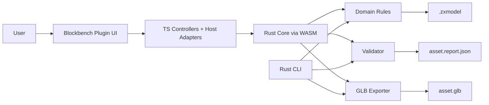
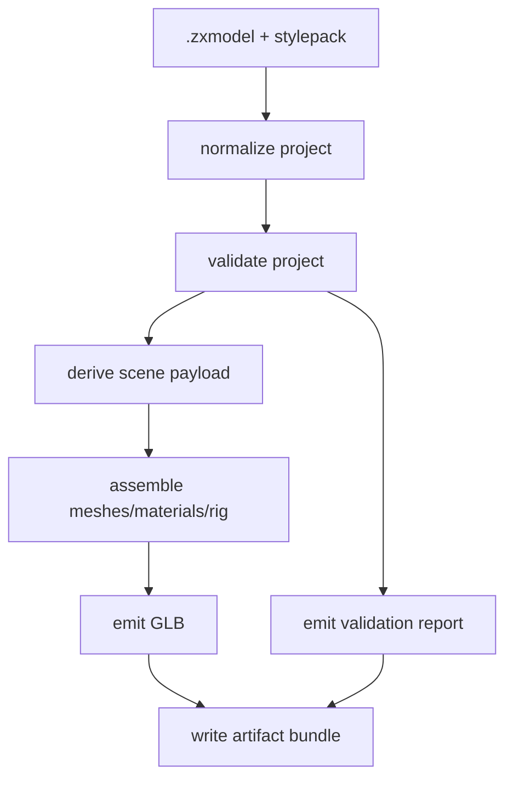

# Technical Architecture

## 1. Architecture summary

PolyBash is a **hybrid editor + deterministic core** system.

- **Editor host:** Blockbench plugin
- **Plugin layer:** TypeScript
- **Core domain + contracts + export + validation:** Rust
- **Primary authoring format:** `.zxmodel`
- **Export target:** `.glb`
- **Core distribution targets:** native CLI + WebAssembly bridge
- **Headless validation target:** CI-friendly command line

The architecture deliberately avoids turning the plugin host into the source of truth. The plugin is the interaction layer. The Rust core owns contracts, normalization, validation, and export semantics.

## 2. Design principles

1. **Own the source format**
   - `.zxmodel` is the canonical authoring format.
   - GLB is output, not the editable source of truth.

2. **Deterministic core**
   - export, validation, and contract logic must live in Rust
   - the same behavior should be available to CLI and plugin via shared core

3. **Headless first**
   - anything critical must be testable without the Blockbench GUI host

4. **Constrained editing**
   - the domain model is module-based and region-based, not arbitrary topology-based

5. **Versioned contracts**
   - schemas and reports are versioned and backward-conscious

## 3. High-level component model



## 4. System responsibilities

### 4.1 Blockbench plugin responsibilities
- panels and UI commands
- library browsing and category filters
- host scene interaction
- transform controls
- edit orchestration
- loading/saving project data to/from `.zxmodel`
- calling the Rust/WASM bridge for validation and export
- displaying validation results

### 4.2 Rust core responsibilities
- contract types and schema generation
- domain normalization
- connector compatibility checks
- deformation math
- budget calculations
- style pack rules
- export assembly
- validation report generation
- structured command DSL validation for LLM edits

### 4.3 CLI responsibilities
- batch validate
- batch export
- headless fixture tests
- CI integration
- developer diagnostics

## 5. Repository structure

```text
polybash/
├─ AGENTS.md
├─ MASTER_SPEC.md
├─ docs/
├─ codex/
├─ examples/
├─ contracts/
│  └─ generated/
├─ crates/
│  ├─ polybash-contracts/
│  ├─ polybash-domain/
│  ├─ polybash-ops/
│  ├─ polybash-validate/
│  ├─ polybash-export/
│  ├─ polybash-llm/
│  ├─ polybash-cli/
│  └─ polybash-wasm/
├─ plugin/
│  ├─ src/
│  │  ├─ adapters/
│  │  ├─ controllers/
│  │  ├─ state/
│  │  ├─ ui/
│  │  ├─ bridge/
│  │  └─ tests/
│  ├─ scripts/
│  └─ dist/
├─ fixtures/
│  ├─ projects/
│  ├─ stylepacks/
│  ├─ reports/
│  └─ exports/
├─ .github/workflows/
└─ tools/
```

## 6. Data model overview

## 6.1 Core entities

### Project
The top-level editable document.

Fields:
- project metadata
- asset metadata
- style pack reference
- module instances
- paint layers
- rig block
- socket metadata
- export preset
- history metadata

### StylePack
Defines the rules for a coherent asset family.

Fields:
- id/version
- supported asset types
- triangle/material/texture budgets
- palettes/material presets
- allowed module categories
- connector taxonomy
- deformation limits
- rig template definitions
- paint rules

### ModuleDescriptor
Defines a reusable asset module.

Fields:
- id/version
- asset type
- tags/category
- connector list
- region list
- material zones
- optional rig tags
- mesh reference
- default transform
- symmetry metadata

### ModuleInstance
Placement of a module descriptor inside a project.

Fields:
- instance id
- module id
- transform
- connector attachment info
- region overrides
- material zone assignments
- optional mirror metadata

### RigTemplate
Defines a rig preset.

Fields:
- id
- asset type compatibility
- bones
- bind pose metadata
- weighting mode
- socket defaults
- export hints

### ValidationReport
Structured output for authoring/export checks.

Fields:
- summary stats
- warnings
- errors
- budget usage
- missing metadata
- source versions
- export status

## 6.2 Canonical formats

### `.zxmodel`
Editable project document.

### `stylepack.json`
Versioned style pack.

### `module.json`
Versioned module descriptor.

### `asset.report.json`
Validation/export report.

### `.glb`
Interchange artifact for downstream tools and engine ingestion.

## 7. Proposed Rust workspace

## 7.1 `polybash-contracts`
Responsibilities:
- canonical Rust structs
- serde support
- schema generation
- version identifiers
- shared enums and ids

Recommended crates:
- `serde`
- `serde_json`
- `schemars`
- `thiserror`
- `uuid` or typed ids if desired

## 7.2 `polybash-domain`
Responsibilities:
- project normalization
- command application
- invariant checks
- basic state transitions
- load/save services

## 7.3 `polybash-ops`
Responsibilities:
- connector math
- transform helpers
- region deformation math
- bounding box and metric calculations

## 7.4 `polybash-validate`
Responsibilities:
- style pack validation
- budget validation
- metadata validation
- connector integrity validation
- export readiness validation

## 7.5 `polybash-export`
Responsibilities:
- transform normalized project into scene payload
- build GLB
- emit report statistics
- optional extras metadata

## 7.6 `polybash-llm`
Responsibilities:
- define structured edit command DSL
- validate command payloads
- translate domain-safe command sequences into project mutations

Note: first implementation can omit live model calls and focus on the command contract.

## 7.7 `polybash-wasm`
Responsibilities:
- expose selected Rust core functions to TypeScript:
  - validate project
  - preview command application
  - apply command
  - export project
  - compute report
  - load style pack

## 7.8 `polybash-cli`
Responsibilities:
- headless export and validation
- fixture runners
- developer commands

## 8. Proposed TypeScript plugin structure

### `adapters/`
Ports to Blockbench APIs and host-specific seams.

### `controllers/`
Use-case orchestration, command dispatch, workflow logic.

### `state/`
In-memory editor state, derived selectors, undo stack metadata.

### `ui/`
Panels, dialogs, module browser, validation panel.

### `bridge/`
WASM boundary and schema runtime validation.

### `tests/`
Controller-level unit tests and adapter contract tests.

## 9. Boundary contract: plugin ↔ core

The plugin must not reach into Rust internals conceptually. Cross-boundary communication should be narrow and versioned.

Suggested boundary functions:
- `load_project(json: string) -> Result<ProjectLoadResponse>`
- `save_project(project: Project) -> Result<String>`
- `validate_project(project, stylepack) -> ValidationReport`
- `apply_edit_commands(project, commands) -> ProjectMutationResult`
- `export_glb(project, stylepack, options) -> ExportBundle`

## 10. Editing model

## 10.1 Module-driven scene graph
Projects are built from module instances attached via connectors or free placement.

## 10.2 Region-driven deformation
Deformations are defined only on authored regions:
- torso.chest
- jaw.width
- shoulder.width
- blade.length
- fender.curve

This avoids arbitrary mesh editing as a first-class concern.

## 10.3 Material zones
Every module exposes explicit material zones:
- primary
- trim
- accent
- skin
- visor
- tire

Material assignment happens at zone level before advanced painting.

## 10.4 Paint layers
Paint sits on top of material zones:
- fill
- decal
- optional brush layer
- future weathering/grime layer

## 11. LLM command DSL

LLM assistance must target a safe DSL.

Example operations:
- `add_module`
- `remove_module`
- `replace_module`
- `set_transform`
- `set_region_param`
- `set_material_zone`
- `set_palette`
- `attach_socket`
- `assign_rig_template`

Example payload:

```json
[
  {
    "op": "replace_module",
    "targetInstanceId": "hair_01",
    "withModuleId": "hair_short_spiky_a"
  },
  {
    "op": "set_region_param",
    "targetInstanceId": "head_01",
    "region": "jaw",
    "param": "width",
    "value": 1.12
  }
]
```

Rules:
- commands are validated before apply
- invalid commands produce structured errors
- preview mode computes diff without mutation
- apply mode returns an undo payload

## 12. Export pipeline



Export bundle:
- `asset.glb`
- `asset.report.json`
- optional debug JSON in dev builds

## 13. Validation pipeline

Validation stages:
1. schema validity
2. project invariants
3. connector integrity
4. style pack compatibility
5. budget checks
6. metadata completeness
7. export readiness

All validation messages should be typed:
- `error`
- `warning`
- `info`

Suggested message fields:
- code
- severity
- path
- summary
- detail
- suggested_fix

## 14. Canonical budgets for first style pack

These are recommended defaults, not engine law.

### Fighter
- triangles: 2,500
- materials: 3
- textures: 1 atlas
- atlas max: 512x512
- bones: 32
- sockets: 8

### Weapon
- triangles: 900
- materials: 2
- atlas max: 256x256

### Prop small
- triangles: 600
- materials: 2
- atlas max: 256x256

### Vehicle small
- triangles: 4,500
- materials: 4
- atlases: 2 x 512x512

## 15. Error handling strategy

- never silently drop invalid modules
- never auto-correct across style pack boundaries without a warning
- fail closed on unknown schema versions
- make validation human-readable and machine-readable

## 16. Testability strategy by layer

### Contracts
- schema round-trip tests
- version tests
- rejection tests for invalid fixtures

### Domain/ops
- property tests
- invariant tests
- golden tests for transform math

### Export
- deterministic snapshot tests
- fixture-based export tests
- validation-before-export tests

### Plugin
- controller unit tests
- adapter seam tests
- headless command flow tests

### Host integration
- minimal smoke checklist
- do not make the first overnight pass depend on GUI automation

## 17. Security and trust boundaries

- no arbitrary shell execution from plugin
- no network requirement for core logic
- LLM command application is mediated through DSL validation
- importers must treat external files as untrusted

## 18. Architecture decisions

### ADR-001
Use Blockbench plugin as the initial editor host instead of building a standalone editor first.

### ADR-002
Use Rust as the source of truth for contracts, validation, and export.

### ADR-003
Keep `.zxmodel` as the authoring format and `.glb` as export output.

### ADR-004
Define LLM integration as structured command generation, not direct mesh synthesis.

### ADR-005
Target a headless-testable walking skeleton before host polish.
