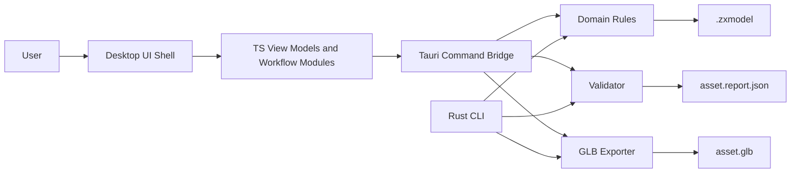
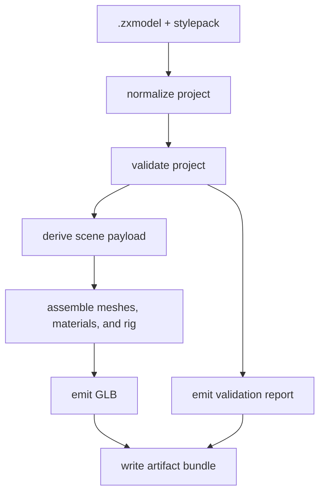

# Technical Architecture

## 1. Architecture summary

PolyBash is a **standalone desktop editor + deterministic core** system.

- **Editor shell:** standalone desktop application
- **Desktop UI layer:** TypeScript + web UI
- **Desktop bridge:** Tauri commands into Rust services
- **Core domain + contracts + export + validation:** Rust
- **Primary authoring format:** `.zxmodel`
- **Export target:** `.glb`
- **Core distribution targets:** native CLI + desktop bridge + optional WebAssembly bridge
- **Headless validation target:** CI-friendly command line

The architecture deliberately avoids turning the desktop shell into the source of truth. The desktop UI is the interaction layer. The Rust core owns contracts, normalization, validation, command semantics, and export behavior.

## 2. Design principles

1. **Own the source format**
   - `.zxmodel` is the canonical authoring format.
   - GLB is output, not the editable source of truth.

2. **Deterministic core**
   - export, validation, and contract logic live in Rust
   - the same behavior should be available to CLI and desktop shell via the shared core

3. **Headless first**
   - anything critical must be testable without the desktop GUI running

4. **Constrained editing**
   - the domain model is module-based and region-based, not arbitrary topology-based

5. **Versioned contracts**
   - schemas and reports are versioned and backward-conscious

## 3. High-level component model



## 4. System responsibilities

### 4.1 Desktop shell responsibilities

- document creation, open, and save flows
- panels, inspectors, module browsing, and workflow commands
- viewport interaction, selection, and gizmo orchestration
- edit orchestration and UI state
- calling Rust services through the desktop bridge
- surfacing validation results, export feedback, and actionable errors

### 4.2 Rust core responsibilities

- contract types and schema generation
- domain normalization
- connector compatibility checks
- deformation math
- budget calculations
- style pack rules
- export assembly
- validation report generation
- structured command DSL validation for LLM edits

### 4.3 CLI responsibilities

- batch validate
- batch export
- headless fixture tests
- CI integration
- developer diagnostics

### 4.4 Desktop bridge responsibilities

- narrow, versioned command surface between UI and Rust
- input and output serialization at the process boundary
- typed error translation into desktop-safe responses
- reuse of the same core services exercised by the CLI

## 5. Current implemented desktop workflows

The current standalone walking skeleton already includes:

- native open and save dialogs
- canonical load and explicit path-based load
- fighter template creation from a style pack
- module add and remove
- transform edits through typed commands
- connector attach and detach
- region parameter edits through typed commands
- material zone edits through typed commands
- rig template selection
- socket metadata authoring
- Rust-owned validation and export preview

These flows live in the desktop app shell, but the underlying state transitions, validation, and export semantics remain Rust-owned.

## 6. Repository structure

```text
polybash/
|- AGENTS.md
|- MASTER_SPEC.md
|- docs/
|- codex/
|- examples/
|- contracts/
|  `- generated/
|- crates/
|  |- polybash-contracts/
|  |- polybash-domain/
|  |- polybash-ops/
|  |- polybash-validate/
|  |- polybash-export/
|  |- polybash-llm/
|  |- polybash-cli/
|  `- polybash-wasm/
|- desktop/
|  |- src/
|  |  |- main.ts
|  |  |- documentPaths.ts
|  |  |- documentInspector.ts
|  |  |- sceneProjection.ts
|  |  |- viewportController.ts
|  |  |- types.ts
|  |  `- colocated desktop UI tests
|  `- src-tauri/
|     |- src/
|     |  |- main.rs
|     |  `- lib.rs
|     `- capabilities/
|- plugin/                 # legacy scaffold, not the active product path
|- fixtures/
|  |- projects/
|  |- stylepacks/
|  |- reports/
|  `- exports/
`- .github/workflows/
```

## 7. Data model overview

## 7.1 Core entities

### Project

The top-level editable document.

Fields:
- project metadata
- asset metadata
- style pack reference
- module instances
- paint layers
- rig block
- socket metadata
- export preset
- history metadata

### StylePack

Defines the rules for a coherent asset family.

Fields:
- id and version
- supported asset types
- triangle, material, and texture budgets
- palettes and material presets
- allowed module categories
- connector taxonomy
- deformation limits
- rig template definitions
- paint rules

### ModuleDescriptor

Defines a reusable asset module.

Fields:
- id and version
- asset type
- tags and category
- connector list
- region list
- material zones
- optional rig tags
- mesh reference
- default transform
- symmetry metadata

### ModuleInstance

Placement of a module descriptor inside a project.

Fields:
- instance id
- module id
- transform
- connector attachment info
- region overrides
- material zone assignments
- optional mirror metadata

### RigTemplate

Defines a rig preset.

Fields:
- id
- asset type compatibility
- bones
- bind pose metadata
- weighting mode
- socket defaults
- export hints

### ValidationReport

Structured output for authoring and export checks.

Fields:
- summary stats
- warnings
- errors
- budget usage
- missing metadata
- source versions
- export status

## 7.2 Canonical formats

### `.zxmodel`
Editable project document.

### `stylepack.json`
Versioned style pack.

### `module.json`
Versioned module descriptor.

### `asset.report.json`
Validation and export report.

### `.glb`
Interchange artifact for downstream tools and engine ingestion.

## 8. Rust workspace

### 8.1 `polybash-contracts`

Responsibilities:
- canonical Rust structs
- serde support
- schema generation
- version identifiers
- shared enums and ids

### 8.2 `polybash-domain`

Responsibilities:
- project normalization
- command application
- invariant checks
- basic state transitions
- load and save services

### 8.3 `polybash-ops`

Responsibilities:
- connector math
- transform helpers
- region deformation math
- bounding box and metric calculations

### 8.4 `polybash-validate`

Responsibilities:
- style pack validation
- budget validation
- metadata validation
- connector integrity validation
- export readiness validation

### 8.5 `polybash-export`

Responsibilities:
- transform normalized project into scene payload
- build GLB
- emit report statistics
- attach export metadata

### 8.6 `polybash-llm`

Responsibilities:
- define structured edit command DSL
- validate command payloads
- translate domain-safe command sequences into project mutations

Note: the first implementation can omit live model calls and focus on the command contract.

### 8.7 `polybash-wasm`

Responsibilities:
- expose selected Rust core functions to TypeScript when a browser-facing or embedded web target is needed
- maintain parity tests for validate and export behavior

This is a secondary surface, not the primary desktop integration path.

### 8.8 `polybash-cli`

Responsibilities:
- headless export and validation
- fixture runners
- developer commands

## 9. Desktop TypeScript surface

The current desktop package is intentionally thin and uses flat modules rather than a large framework:

- `main.ts`
  - app shell
  - Tauri command invocation
  - document actions
  - inspector event wiring
- `documentPaths.ts`
  - native dialog path normalization
  - save-path suggestion helpers
- `documentInspector.ts`
  - module cards
  - module library projection
  - connector options
  - rig detail projection
- `sceneProjection.ts`
  - deterministic low-poly proxy scene projection
- `viewportController.ts`
  - Three.js viewport mounting and selection callbacks
- `types.ts`
  - desktop-facing TypeScript types
- colocated `*.spec.ts`
  - headless desktop UI workflow coverage

## 10. Boundary contract: desktop UI <-> core

The desktop UI must not reach into Rust internals conceptually. Cross-boundary communication should be narrow and versioned.

Current implemented commands include:
- `load_canonical_document_command`
- `create_fighter_template_command`
- `load_document_command`
- `save_project_command`
- `add_module_instance_command`
- `remove_module_instance_command`
- `apply_edit_command_command`
- `set_connector_attachment_command`
- `clear_connector_attachment_command`
- `validate_document_command`
- `export_document_command`

Conceptually, these map to:
- load project
- save project
- validate project
- apply edit commands
- set or clear connector relationships
- export GLB bundle

The current typed edit-command path covers:
- transform updates
- region parameter updates
- material assignment
- rig template assignment
- socket authoring

## 11. Editing model

## 11.1 Module-driven scene graph

Projects are built from module instances attached via connectors or free placement.

## 11.2 Region-driven deformation

Deformations are defined only on authored regions:
- torso.chest
- jaw.width
- shoulder.width
- blade.length
- fender.curve

This avoids arbitrary mesh editing as a first-class concern.

## 11.3 Material zones

Every module exposes explicit material zones:
- primary
- trim
- accent
- skin
- visor
- tire

Material assignment happens at zone level before advanced painting.

## 11.4 Paint layers

Paint sits on top of material zones:
- fill
- decal
- optional brush layer
- future weathering layer

## 11.5 Blender handoff material and UV boundary

The current reusable-module import contract is intentionally metadata-first:
- Blender owns topology authoring, UV unwrap and UV edits, and the exported source `.glb`
- PolyBash owns the import contract (`.moduleimport.json` or descriptor-style `.module.json`), reusable connector and region metadata, declared material zones, assembly, validation, and downstream export

For the current M2 slice, imported-module validation asserts:
- `sourceAsset.format` is `glb`
- the referenced `sourceAsset.path` exists
- `materialZones` are present, non-empty, and unique

The current validator does not deeply inspect UV layouts or mesh contents. That remains a Blender-owned boundary and a documentation-plus-fixture contract rather than a mesh-analysis feature, and it is the intended M2 scope boundary rather than a temporary partial implementation.

## 12. LLM command DSL

LLM assistance must target a safe DSL.

Example operations:
- `add_module`
- `remove_module`
- `replace_module`
- `set_transform`
- `set_region_param`
- `set_material_zone`
- `set_palette`
- `attach_socket`
- `assign_rig_template`

Example payload:

```json
[
  {
    "op": "replace_module",
    "targetInstanceId": "hair_01",
    "withModuleId": "hair_short_spiky_a"
  },
  {
    "op": "set_region_param",
    "targetInstanceId": "head_01",
    "region": "jaw",
    "param": "width",
    "value": 1.12
  }
]
```

Rules:
- commands are validated before apply
- invalid commands produce structured errors
- preview mode computes diff without mutation
- apply mode returns an undo payload

## 13. Export pipeline



Export bundle:
- `asset.glb`
- `asset.report.json`
- optional debug JSON in dev builds

## 14. Validation pipeline

Validation stages:
1. schema validity
2. project invariants
3. connector integrity
4. style pack compatibility
5. budget checks
6. metadata completeness
7. export readiness

All validation messages should be typed:
- `error`
- `warning`
- `info`

Suggested message fields:
- code
- severity
- path
- summary
- detail
- suggested_fix

## 15. Canonical budgets for first style pack

These are recommended defaults, not engine law.

### Fighter
- triangles: 2,500
- materials: 3
- textures: 1 atlas
- atlas max: 512x512
- bones: 32
- sockets: 8

### Weapon
- triangles: 900
- materials: 2
- atlas max: 256x256

### Prop small
- triangles: 600
- materials: 2
- atlas max: 256x256

### Vehicle small
- triangles: 4,500
- materials: 4
- atlases: 2 x 512x512

## 16. Error handling strategy

- never silently drop invalid modules
- never auto-correct across style pack boundaries without a warning
- fail closed on unknown schema versions
- make validation human-readable and machine-readable

## 17. Testability strategy by layer

### Contracts
- schema round-trip tests
- version tests
- rejection tests for invalid fixtures

### Domain and ops
- property tests
- invariant tests
- golden tests for transform math

### Export
- deterministic snapshot tests
- fixture-based export tests
- validation-before-export tests

### Desktop UI
- projection and inspector unit tests
- desktop bridge seam tests
- headless document workflow tests

### Desktop integration
- minimal smoke checklist
- do not make the first overnight pass depend on GUI automation

## 18. Security and trust boundaries

- no arbitrary shell execution from the desktop shell
- no network requirement for core logic
- LLM command application is mediated through DSL validation
- importers must treat external files as untrusted

## 19. Architecture decisions

### ADR-001
Use a standalone desktop shell as the initial editor host instead of relying on an external modeling host.

### ADR-002
Use Rust as the source of truth for contracts, validation, domain rules, and export.

### ADR-003
Keep `.zxmodel` as the authoring format and `.glb` as export output.

### ADR-004
Define LLM integration as structured command generation, not direct mesh synthesis.

### ADR-005
Target a headless-testable walking skeleton before desktop-shell polish.
